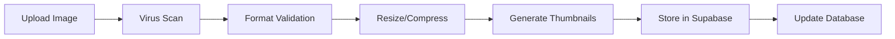

# Backend Operations Documentation
# CacawInventory

## Architecture Overview

CacawInventory follows a **local-first** architecture with optional cloud synchronization. The backend operations are minimal in Phase 1 (landing page only) but will expand significantly in subsequent phases.

## Phase-by-Phase Backend Evolution

### Phase 1: Landing Page (Current)
**Backend Requirements**: Minimal
- Static site hosting
- Optional email capture service
- Basic analytics

### Phase 2: Core Application
**Backend Requirements**: Client-side focused
- IndexedDB for local storage
- Service Worker for offline capabilities
- Client-side AI API integration (Google Gemini)

### Phase 3: Cloud Integration
**Backend Requirements**: Full backend services
- User authentication
- Database management
- File/image storage
- Synchronization services

## Detailed Backend Components

### 1. Data Storage Strategy

#### Local Storage (Phase 2)
```typescript
// IndexedDB Configuration
interface StorageConfig {
  databaseName: 'CacawInventory'
  version: 1
  stores: {
    folders: 'id, name, createdAt, updatedAt'
    items: 'id, folderId, name, type, createdAt'
    images: 'id, itemId, blob, thumbnail'
    settings: 'key, value'
  }
}
```

#### Cloud Storage (Phase 3)
- **Primary Database**: Supabase PostgreSQL
- **File Storage**: Supabase Storage for images
- **Caching**: Redis for session management
- **Search**: PostgreSQL full-text search with GIN indexes

### 2. Authentication System (Phase 3)

#### User Management
```sql
-- Users table (Supabase Auth integration)
CREATE TABLE profiles (
  id UUID REFERENCES auth.users PRIMARY KEY,
  email TEXT UNIQUE NOT NULL,
  username TEXT UNIQUE,
  created_at TIMESTAMP WITH TIME ZONE DEFAULT NOW(),
  updated_at TIMESTAMP WITH TIME ZONE DEFAULT NOW(),
  subscription_tier TEXT DEFAULT 'free',
  storage_used BIGINT DEFAULT 0,
  storage_limit BIGINT DEFAULT 1073741824 -- 1GB
);
```

#### Authentication Flow
1. **Email/Password Registration**
2. **Email Verification**
3. **JWT Token Management**
4. **Session Persistence**
5. **Password Reset Flow**

### 3. API Gateway & Rate Limiting

#### Google Gemini AI Proxy (Phase 2)
```typescript
// Rate limiting configuration
interface RateLimitConfig {
  windowMs: 15 * 60 * 1000; // 15 minutes
  maxRequests: 100; // per window per user
  skipSuccessfulRequests: false;
  skipFailedRequests: false;
}

// AI Detection Endpoint
POST /api/detect
Headers: Authorization: Bearer <jwt_token>
Body: { image: string, prompt?: string }
Response: { items: DetectedItem[], confidence: number, processingTime: number }
```

#### Pricing & Cost Management
- **Gemini API Costs**: ~$0.002 per image
- **Rate Limiting**: 100 requests per 15 minutes per user
- **Batch Processing**: Support for multiple images
- **Fallback Strategies**: Local OCR when API unavailable

### 4. File Management System (Phase 3)

#### Image Processing Pipeline


#### Storage Optimization
- **Compression**: WebP format with 80% quality
- **Thumbnails**: 150x150px and 300x300px versions
- **CDN**: Supabase Edge for global distribution
- **Cleanup**: Orphaned file removal cron job

### 5. Synchronization Engine (Phase 3)

#### Conflict Resolution Strategy
```typescript
interface SyncConflict {
  localVersion: ItemData;
  remoteVersion: ItemData;
  conflictType: 'update' | 'delete' | 'create';
  resolution: 'local_wins' | 'remote_wins' | 'manual';
}
```

#### Sync Operations
1. **Full Sync**: Initial data download
2. **Incremental Sync**: Changes since last sync
3. **Conflict Detection**: Last-modified timestamp comparison
4. **Resolution**: User-choice or automatic based on rules

### 6. Background Jobs & Maintenance

#### Scheduled Tasks
```typescript
// Cron job configurations
interface ScheduledJobs {
  'cleanup-orphaned-files': '0 2 * * *';      // Daily at 2 AM
  'generate-usage-reports': '0 0 * * 0';      // Weekly on Sunday
  'backup-database': '0 1 * * *';             // Daily at 1 AM
  'update-market-prices': '0 */6 * * *';      // Every 6 hours
}
```

#### Health Monitoring
- **Uptime Monitoring**: Ping endpoints every 5 minutes
- **Performance Metrics**: Response time, error rates
- **Resource Usage**: CPU, memory, storage utilization
- **Alert System**: Email/Slack notifications for issues

### 7. Security & Privacy

#### Data Protection
- **Encryption at Rest**: AES-256 for sensitive data
- **Encryption in Transit**: TLS 1.3 for all communications
- **API Security**: JWT tokens with 24-hour expiration
- **Input Validation**: Strict sanitization for all inputs

#### Privacy Compliance
- **GDPR Compliance**: Data portability and deletion rights
- **Data Minimization**: Only collect necessary information
- **Audit Logging**: Track all data access and modifications
- **Cookie Policy**: Minimal essential cookies only

### 8. Performance & Scalability

#### Database Optimization
```sql
-- Key indexes for performance
CREATE INDEX idx_items_folder_id ON items(folder_id);
CREATE INDEX idx_items_created_at ON items(created_at DESC);
CREATE INDEX idx_folders_user_id ON folders(user_id);
CREATE INDEX idx_images_item_id ON images(item_id);

-- Full-text search indexes
CREATE INDEX idx_items_search ON items USING GIN(to_tsvector('english', name || ' ' || COALESCE(notes, '')));
```

#### Caching Strategy
- **Application Cache**: Redis with 1-hour TTL for user sessions
- **Query Cache**: PostgreSQL query result caching
- **CDN Cache**: 24-hour cache for static assets
- **Browser Cache**: Aggressive caching for images and fonts

### 9. Backup & Disaster Recovery

#### Backup Strategy
- **Database**: Daily full backups, hourly incrementals
- **File Storage**: Daily rsync to secondary location
- **Configuration**: Version-controlled infrastructure as code
- **Testing**: Monthly restoration drills

#### Recovery Procedures
1. **Data Corruption**: Restore from most recent clean backup
2. **Service Outage**: Failover to backup infrastructure
3. **Security Breach**: Immediate isolation and forensic analysis
4. **User Data Loss**: Point-in-time recovery capabilities

### 10. Monitoring & Analytics

#### Technical Metrics
- **API Response Times**: 95th percentile < 500ms
- **Error Rates**: < 1% for all endpoints
- **Uptime**: 99.9% availability target
- **Database Performance**: Query times, connection pools

#### Business Metrics
- **User Engagement**: Daily active users, session duration
- **Feature Usage**: Most/least used features
- **AI Performance**: Detection accuracy, user corrections
- **Storage Growth**: User data volume trends

---

## Future Considerations

### Phase 4+: Advanced Features
- **Machine Learning Pipeline**: Custom model training
- **Real-time Collaboration**: WebSocket connections
- **Marketplace Integration**: Third-party API connections
- **Mobile App Backend**: GraphQL API for mobile clients

### Scalability Planning
- **Horizontal Scaling**: Kubernetes deployment
- **Database Sharding**: User-based partitioning
- **Microservices**: Service decomposition for specific domains
- **Edge Computing**: Regional processing nodes

---

*Backend documentation version: 1.0*  
*Last updated: [Current Date]*  
*Next review: Phase 2 planning*