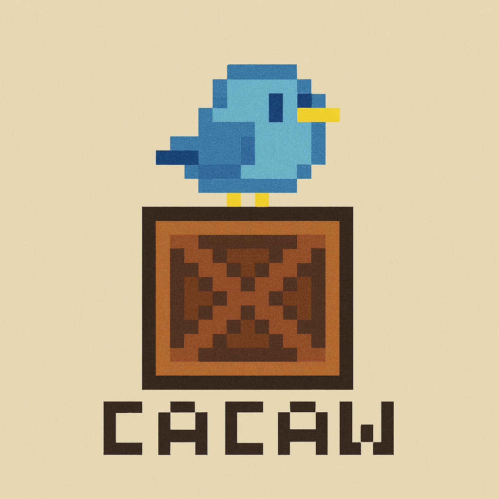

<div style="display:grid; place-items: center;">
   
</div>

# Cacaw AI Inventory

Hoard it like a crow, store it like a pro!


## 🎯 Features

- 📦 **Collection Management:** Organize, tag, and track collectibles with detailed information and photos.
- 🤖 **AI-Powered Detection:** Instantly identify collectibles and extract details from photos using computer vision.
- 💾 **Data Persistence:** Securely store, export, and back up your collection data locally for offline access.
- 🕹️ **User Experience:** Enjoy a retro pixel art interface with smooth, responsive, and intuitive navigation.

## User Journey


---

## 🖼️ Demo

[▶️ Capture page flow](https://github.com/lyqht/cacaw_inventory/blob/883f09f56adaa9d118fbfd09a476f2d1cb7748a1/demo/Capture%20page%20flow%20-%20teck%20-%20with%20captions.mp4)

[▶️ List & Grid View](https://github.com/lyqht/cacaw_inventory/blob/883f09f56adaa9d118fbfd09a476f2d1cb7748a1/demo/List%20%26%20Grid%20View%20-%20with%20captions.mp4)

[▶️ Importing JSON](https://github.com/lyqht/cacaw_inventory/blob/883f09f56adaa9d118fbfd09a476f2d1cb7748a1/demo/Import%20demo%20-%20with%20captions.mp4)

---

### **Key Features**

1. **Multi-View Navigation**
   - Capture Page (AI-powered item detection)
   - Folders Page (collection organization)
   - Items Page (detailed item management)
   - Settings Page (user preferences)
2. **Data Management**
   - **Folders**: Organize collections by type (trading cards, action figures, etc.)
   - **Items**: Detailed collectible records with metadata
   - **Images**: Blobs converted into Base64 Urls before being saved
   - **AI Detection**: Automated item identification, with custom API key support
3. **Storage System**
   - **IndexedDB** via Dexie.js for local storage
   - Data export/import capabilities
   - Image compression and optimization

---

## 🛠️ Tech Stack

### **Frontend Framework**

- **React 18** with TypeScript
- **Vite** as the build tool and dev server
- **Tailwind CSS** for styling with custom retro theme

### **State Management**

- **Zustand** for global state management
- **Dexie.js** (IndexedDB wrapper) for local data persistence

### **UI/UX**

- **Lucide React** for icons
- Custom pixel art theme with retro aesthetics
- Responsive design with mobile-first approach

---

## 📁 Project Structure

### **Core Architecture**

```
src/
├── components/     # Reusable UI components
├── pages/         # Main application views
├── services/      # Business logic and external APIs
├── stores/        # State management
├── types/         # TypeScript type definitions
└── App.tsx        # Main application component
```

---

## 🛠️ Design System

### **Retro Pixel Theme**

- Custom color palette with light/dark themes
- Pixel-perfect spacing and animations
- Retro typography (Press Start 2P, Pixelify Sans)
- Custom animations (bird-hop, pixel-pulse, etc.)

### **Component Architecture**

- Modular component design
- Reusable UI components (Button, Card, Modal, etc.)
- Consistent styling patterns
- Accessibility considerations

---

## 🛠️ User Experience

- **Responsive design** for mobile and desktop
- **Smooth animations** and pixel-perfect interactions
- **Error boundaries** for robust error handling

---

## 🚀 Development Setup

### Prerequisites

- Node.js (v16 or higher)
- npm or yarn

### Installation

```bash
# Clone the repository
git clone <repository-url>
cd cacaw_inventory

# Install dependencies
npm install

# (Automatic) Remove Fingerprint icon from lucide-react to prevent ad blocker issues
# This is handled by a postinstall script. If you see issues with missing icons, see FAQ below.

# Start development server
npm run dev

# Build for production
npm run build

# Run tests
npm test
```

### Available Scripts

- `npm run dev` - Start development server
- `npm run build` - Build for production
- `npm run lint` - Run ESLint
- `npm run preview` - Preview production build
- `npm test` - Run tests
- `npm run test:ui` - Run tests with UI

## 📄 License

This project is licensed under the MIT License - see the LICENSE file for details.

## ❓ FAQ / Troubleshooting

**Q: Why do I see errors about 'fingerprint.js' being blocked or missing in development?**
A: Some ad blockers or privacy extensions block files with 'fingerprint' in the name, which can break icon imports from lucide-react. This project includes a postinstall script that automatically removes the Fingerprint icon from lucide-react after install. If you still see issues, try disabling your ad blocker for localhost or re-run `npm install` to ensure the script runs.

**Q: How do I reset my local data?**
A: Clear your browser's IndexedDB storage for this site.

**Q: Why isn't AI detection working?**
A: Make sure your API key is set up in the Settings page and you have a stable internet connection.
